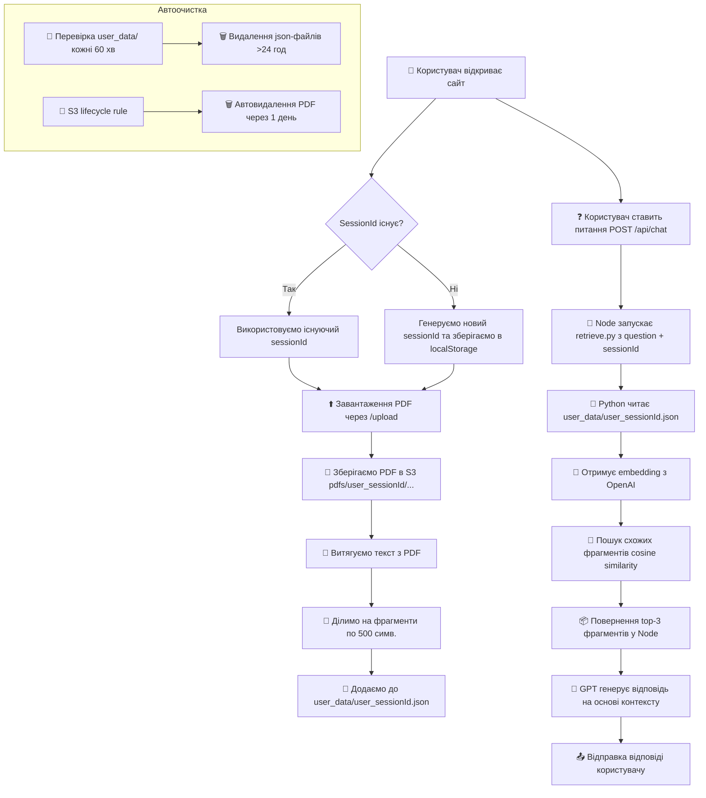

# 🧠 GPT-RAG бот із підтримкою PDF + SessionId + S3 + Auto-Cleanup

Цей проєкт — готовий до деплою GPT-базований чат-бот, який:
- працює тільки на основі локальної бази знань
- дозволяє завантажити кілька PDF в межах однієї сесії
- очищає всі файли через 24 години

## 📦 Технології
- Node.js (Express)
- Python (OpenAI Embedding + Cosine Similarity)
- AWS S3 (для PDF)
- Render (хостинг)
- OpenAI API

