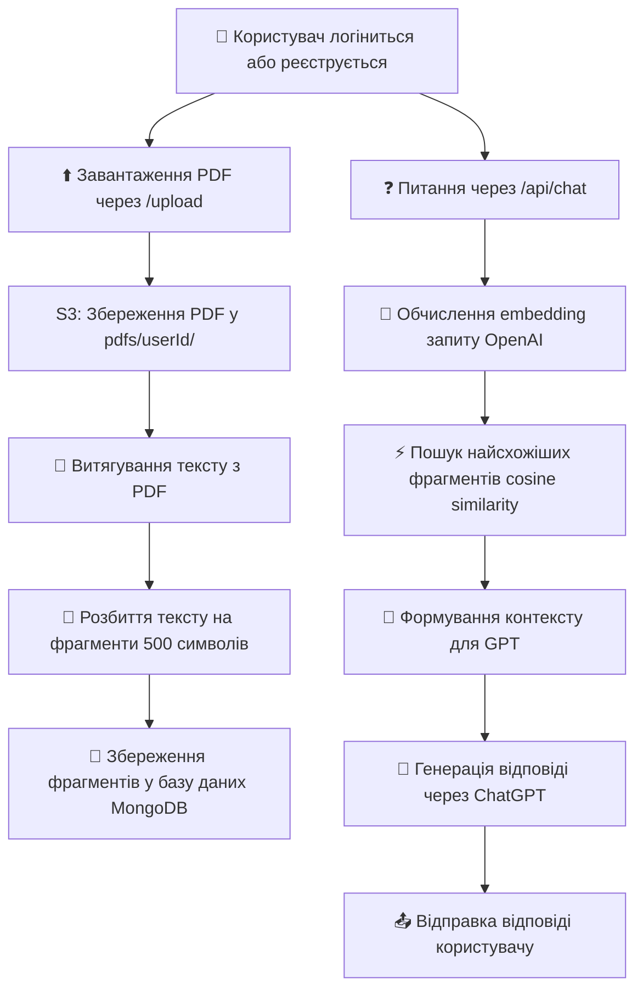

# 🧠 GPT-RAG бот із підтримкою PDF + Авторизації + S3 + Автоочищення

Цей проєкт — готовий до деплою GPT-базований чат-бот, який:
- працює тільки на основі персональної бази знань користувача
- підтримує авторизацію користувачів (реєстрація/вхід)

---

## 📦 Технології

- Node.js (Express)
- MongoDB Atlas (База користувачів + документи)
- AWS S3 (для зберігання PDF)
- TailwindCSS + Vue 3 (Фронтенд)
- OpenAI API (Embedding + Chat Completion)
- Render (Хостинг бекенду)

---

## 🔥 Основні фічі

- 📚 Кожен користувач має свою базу знань
- ⬆️ Завантаження PDF-файлів напряму в Amazon S3
- 🧠 Розбиття PDF на фрагменти та збереження у базу даних
- 🔐 Авторизація через токени (JWT)
- 🧹 Автоматичне очищення старих файлів і записів
- 🚀 Пошук найбільш релевантних фрагментів через cosine similarity
- 🤖 Генерація відповідей GPT на основі персонального контексту

---

## 📜 Архітектура процесу

